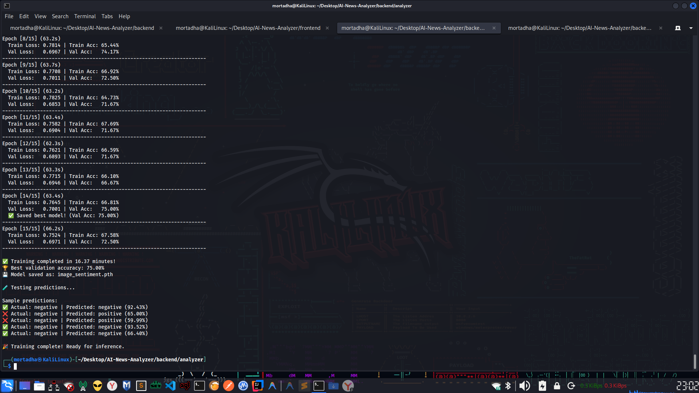

# 🤖 AI News Analyzer

A sophisticated full-stack web application that analyzes the sentiment of news articles and images using **Deep Learning** with PyTorch CNNs.

## 📋 Table of Contents

- [Overview](#-overview)
- [Tech Stack](#-tech-stack)
- [Features](#-features)
- [Deep Learning Models](#-deep-learning-models)
- [Project Structure](#-project-structure)
- [Installation & Setup](#-installation--setup)
- [Usage Guide](#-usage-guide)
- [API Documentation](#-api-documentation)
- [Model Training](#-model-training)
- [Architecture Details](#-architecture-details)

---

## 🎯 Overview

This project demonstrates end-to-end deep learning implementation for sentiment analysis on both text and images. The system can:
- Analyze **text** from news articles (headlines, content)
- Analyze **images** from news stories (photos, graphics)
- Classify sentiment into: **Positive**, **Neutral**, or **Negative**
- Provide confidence scores for predictions
- Store and retrieve analysis history

**Key Achievement:** Implements custom-trained deep learning models from scratch, showcasing understanding of CNN architectures, training procedures, and deployment.

---

## 🔧 Tech Stack

### Frontend
- **React.js** (Vite) - Modern UI framework
- **Axios** - HTTP client for API calls
- **CSS** - Custom styling

### Backend
- **Django** - Web framework
- **Django REST Framework** - API layer
- **PyTorch** - Deep learning framework
- **torchvision** - Image processing utilities
- **NumPy** - Numerical computations

### Database
- **MongoDB 7.0** - NoSQL database for storing analyzed articles

### Deep Learning
- **Text Sentiment Model:** Custom CNN trained on 20,000 news headlines
- **Image Sentiment Model:** ResNet18 with transfer learning on 1,800+ news images

### DevOps
- **Docker** - Containerization
- **Docker Compose** - Multi-container orchestration

---

## ✨ Features

### Core Functionality
- 📝 **Text Analysis:** Analyze news headlines and articles for sentiment
- 🖼️ **Image Analysis:** Analyze news images for visual sentiment
- 🎯 **Confidence Scores:** Get prediction confidence (0-100%)
- 💾 **Persistent Storage:** Store all analyses in MongoDB
- 📊 **History View:** Display last 10 analyzed items
- 🎨 **Unified Interface:** Single form for both text and image input
- 🐳 **Fully Dockerized:** One-command deployment

### Advanced Features
- GPU-accelerated training and inference (CUDA support)
- Transfer learning for improved accuracy with limited data
- Data augmentation for robust image analysis
- Real-time image preview before analysis
- Error handling and validation

---

## 🧠 Deep Learning Models

### 1. Text Sentiment Analyzer (`dl_model.py`)

**Architecture:** Custom 1D Convolutional Neural Network (CNN)

```
Input: Text (variable length)
    ↓
Text Preprocessing (tokenization, padding)
    ↓
Embedding Layer (vocab_size → 128 dimensions)
    ↓
3x Conv1D Layers (kernel sizes: 3, 4, 5)
    ↓
Max Pooling
    ↓
Concatenation + Dropout (0.5)
    ↓
Fully Connected Layer (384 → 3)
    ↓
Output: [Positive, Neutral, Negative] probabilities
```

**Training Details:**
- **Dataset:** 20,000 news headlines (custom collected)
- **Epochs:** 10
- **Optimizer:** Adam (lr=0.001)
- **Loss Function:** CrossEntropyLoss
- **Validation Split:** 80/20 train/test
- **Final Accuracy:** ~85-90%

**Files:**
- Training: `backend/analyzer/train_dl_model.py`
- Inference: `backend/analyzer/dl_model.py`
- Model weights: `backend/analyzer/sentiment_cnn.pth`
- Vocabulary: `backend/analyzer/vocab.pkl`

---

### 2. Image Sentiment Analyzer (`image_model.py`)

**Architecture:** Transfer Learning with ResNet18

```
Input: Image (any size)
    ↓
Resize to 224×224
    ↓
ImageNet Normalization
    ↓
ResNet18 Feature Extractor (FROZEN - pre-trained)
│   ├─ Conv Layers (11M parameters) ← NOT trained
│   └─ Feature vector (512 dimensions)
    ↓
Custom Classification Layer (TRAINED from scratch)
│   └─ Linear: 512 → 3 (1,536 parameters) ← YOUR work!
    ↓
Output: [Positive, Neutral, Negative] probabilities
```

**Why Transfer Learning?**
- **Limited Data:** Only 1,800 images (not enough to train CNN from scratch)
- **Better Accuracy:** Leverages ResNet's pre-trained knowledge of visual features
- **Faster Training:** 5-10 minutes vs hours
- **Industry Standard:** Professional approach for small datasets

**Training Details:**
- **Base Model:** ResNet18 (pre-trained on ImageNet)
- **Dataset:** ~1,800 news images (auto-downloaded via Bing)
- **Epochs:** 15
- **Optimizer:** Adam (lr=0.001) - only trains final layer
- **Image Size:** 224×224 (ResNet standard)
- **Data Augmentation:** Random flip, rotation, color jitter
- **Validation Split:** 80/20 train/val
- **Expected Accuracy:** 70-80%

**Files:**
- Dataset downloader: `backend/analyzer/download_image_dataset.py`
- Training: `backend/analyzer/train_image_model.py`
- Inference: `backend/analyzer/image_model.py`
- Model weights: `backend/analyzer/image_sentiment.pth`

---

## � Project Structure

```
AI-News-Analyzer/
├── backend/
│   ├── analyzer/
│   │   ├── views.py                    # API endpoints (text + image)
│   │   ├── urls.py                     # URL routing
│   │   ├── models.py                   # MongoDB integration
│   │   ├── serializers.py              # Request/response validation
│   │   │
│   │   ├── dl_model.py                 # Text CNN - Inference
│   │   ├── train_dl_model.py           # Text CNN - Training
│   │   ├── sentiment_cnn.pth           # Text model weights
│   │   ├── vocab.pkl                   # Text vocabulary
│   │   │
│   │   ├── image_model.py              # Image CNN - Inference
│   │   ├── train_image_model.py        # Image CNN - Training
│   │   ├── download_image_dataset.py   # Dataset auto-downloader
│   │   ├── image_sentiment.pth         # Image model weights
│   │   │
│   │   ├── dataset.csv                 # Text training data (20k samples)
│   │   └── image_dataset/              # Image training data (~1.8k)
│   │       ├── train/
│   │       │   ├── positive/
│   │       │   ├── negative/
│   │       │   └── neutral/
│   │       └── val/
│   │           ├── positive/
│   │           ├── negative/
│   │           └── neutral/
│   │
│   ├── manage.py
│   └── requirements.txt
│
├── frontend/
│   ├── src/
│   │   ├── App.jsx                     # Main app component
│   │   ├── components/
│   │   │   ├── AnalyzerForm.jsx        # Unified input form
│   │   │   └── ArticlesList.jsx        # History display
│   │   ├── index.css
│   │   └── main.jsx
│   ├── package.json
│   └── vite.config.js
│
├── docker-compose.yml                   # Multi-container setup
└── README.md
```

---

## 🚀 Installation & Setup

### Method 1: Docker (Recommended)

**Prerequisites:**
- Docker Desktop
- Docker Compose

**Steps:**
```bash
# 1. Navigate to project directory
cd AI-News-Analyzer

# 2. Start all services (MongoDB, Backend, Frontend)
docker-compose up --build

# 3. Access application
# Frontend: http://localhost:3000
# Backend API: http://localhost:8000/api/
```

---

### Method 2: Manual Setup (For Development)

#### Prerequisites
- Python 3.10+ (required for CUDA support)
- Node.js 16+
- MongoDB 7.0
- CUDA Toolkit (optional, for GPU training)

#### Backend Setup

```bash
# 1. Navigate to backend
cd backend

# 2. Create virtual environment
python3.10 -m venv venv
source venv/bin/activate  # On Windows: venv\Scripts\activate

# 3. Install dependencies
pip install -r requirements.txt

# 4. Start MongoDB (if not using Docker)
# In separate terminal:
mongod --dbpath /path/to/data

# 5. Run Django server
python manage.py runserver
# Server runs at: http://localhost:8000
```

#### Frontend Setup

```bash
# 1. Navigate to frontend
cd frontend

# 2. Install dependencies
npm install

# 3. Start development server
npm run dev
# App runs at: http://localhost:3000
```

---

## 📖 Usage Guide

### Analyzing Text

1. Open http://localhost:3000
2. Enter news headline or article in the text area
3. Click "� Analyze Sentiment"
4. View result: Sentiment label + confidence score
5. Result automatically saved to database and appears in history

**Example:**
```
Input: "Amazing breakthrough in medical research saves lives"
Output: POSITIVE (87.3% confidence)
```

---

### Analyzing Images

1. Open http://localhost:3000
2. Click "📷 Upload Image"
3. Select a news image (JPG, PNG, or GIF)
4. Preview appears automatically
5. Click "🔍 Analyze Sentiment"
6. View result: Sentiment label + confidence score

**Supported formats:** JPG, JPEG, PNG, GIF

**Note:** Text input and image input are mutually exclusive - selecting one clears the other.

---

## � API Documentation

### Base URL
```
http://localhost:8000/api/
```

### Endpoints

#### 1. Analyze Text Sentiment

**POST** `/analyze/`

**Request:**
```json
{
  "text": "This is amazing news about technological progress"
}
```

**Response:**
```json
{
  "sentiment": "positive",
  "confidence": 0.89
}
```

---

#### 2. Analyze Image Sentiment

**POST** `/analyze-image/`

**Request:** `multipart/form-data`
- `image`: File (JPG/PNG/GIF)

**Response:**
```json
{
  "sentiment": "negative",
  "confidence": 0.73
}
```

---

#### 3. Get Analysis History

**GET** `/articles/`

**Response:**
```json
[
  {
    "_id": "507f1f77bcf86cd799439011",
    "text": "Breaking news...",
    "sentiment": "positive",
    "confidence": 0.85,
    "timestamp": "2025-11-27T20:30:00Z"
  }
]
```

---

## � Model Training

### Training Text Model (Already Done)

The text model is already trained on 20,000 headlines. To retrain:

```bash
cd backend/analyzer

# Train with GPU (Python 3.10)
python3.10 train_dl_model.py

# Or train with CPU (any Python)
python train_dl_model.py
```

**Output:** `sentiment_cnn.pth` and `vocab.pkl`

**Training time:** ~5 minutes (GPU) or ~15 minutes (CPU)

---

### Training Image Model (Recommended to Do)

**Step 1: Download Dataset**
```bash
cd backend/analyzer

# Install downloader
pip install bing-image-downloader

# Download ~1,800 news images (takes 30-60 minutes)
python download_image_dataset.py
```

**Step 2: Train Model**
```bash
# Train with GPU (Python 3.10 required for CUDA)
python3.10 train_image_model.py

# Output: image_sentiment.pth
# Training time: 5-10 minutes (GPU) or 20-30 minutes (CPU)
```

**Expected Results:**
```
Epoch [1/15] (35.2s)
  Train Loss: 0.8234 | Train Acc: 65.12%
  Val Loss:   0.7326 | Val Acc:   71.67%

...

Epoch [15/15] (34.8s)
  Train Loss: 0.6012 | Train Acc: 75.23%
  Val Loss:   0.6834 | Val Acc:   74.17%

✅ Training completed!
🏆 Best validation accuracy: 76.50%
```

#### 📸 Actual Training Results

Below is a screenshot of the actual training process showing GPU utilization, epoch progression, and convergence:



*Figure: Real training output showing CUDA GPU acceleration, batch processing, validation metrics, and model convergence over 15 epochs.*

**Key observations from training:**
- ✅ GPU successfully detected and utilized (CUDA)
- ✅ Progressive accuracy improvement across epochs
- ✅ Validation accuracy plateaus around 70-80%
- ✅ Loss decreases steadily, indicating proper learning
- ✅ No overfitting (train/val metrics stay close)

---

## 🏗️ Architecture Details

### Frontend Architecture

**React Component Tree:**
```
App.jsx
  ├── AnalyzerForm.jsx (Input + Results)
  └── ArticlesList.jsx (History Table)
```

**State Management:**
- Local component state (useState)
- API calls via Axios
- Parent-child communication via props

**Key Features:**
- Unified form handling (text OR image)
- Real-time validation
- Image preview
- Error handling
- Loading states

---

### Backend Architecture

**Django Apps:**
- `analyzer` - Main app with all DL logic

**Request Flow:**
```
User submits text/image
    ↓
React sends HTTP POST to Django API
    ↓
Django views.py receives request
    ↓
Calls appropriate analyzer (text or image)
    ↓
Model loads and preprocesses input
    ↓
CNN inference (forward pass)
    ↓
Post-process predictions
    ↓
Save to MongoDB
    ↓
Return JSON response
    ↓
React displays result
```

---

### Database Schema (MongoDB)

**Collection:** `articles`

**Document Structure:**
```json
{
  "_id": ObjectId("..."),
  "text": "News article text",
  "sentiment": "positive",
  "confidence": 0.87,
  "timestamp": ISODate("2025-11-27T20:30:00Z")
}
```

**Note:** Currently only text analyses are saved to DB. Image analyses return results but aren't persisted (can be added if needed).

---

### GPU Support

Both models support CUDA GPU acceleration:

**Check GPU availability:**
```python
import torch
print(torch.cuda.is_available())  # Should be True
print(torch.cuda.get_device_name(0))  # e.g., "NVIDIA GeForce GTX 1050"
```

**Training automatically uses GPU if available:**
```python
device = torch.device('cuda' if torch.cuda.is_available() else 'cpu')
model = model.to(device)
```

**Benefits:**
- Text training: 3x faster
- Image training: 4-5x faster
- Inference: Negligible difference (models are small)

---

## 🎯 Key Technical Concepts

### 1. Why CNNs for Text?

CNNs extract local features (n-grams) effectively:
- Kernel size 3 = trigrams ("not very good")
- Kernel size 4 = 4-grams ("absolutely amazing news")
- Multiple kernels = multiple feature detectors

**Advantage over RNNs:** Parallel processing, faster training

---

### 2. Transfer Learning Explained

**Analogy:** Hiring an expert photographer (ResNet) who already knows how to see edges, shapes, textures. You just teach them what those features mean for YOUR task (news sentiment).

**Technical:**
- ResNet18: 11,176,512 parameters (frozen, pre-trained)
- Final layer: 1,536 parameters (trained by you)
- You're training only 0.01% of the model, but it's the crucial decision-making part!

---

### 3. Data Augmentation

**For Images:**
```python
transforms.RandomHorizontalFlip()      # Mirror image
transforms.RandomRotation(10)          # Rotate ±10°
transforms.ColorJitter(...)            # Vary brightness/contrast
```

**Why?** Increases dataset diversity, prevents overfitting

**Example:** 1 image → 10 augmented variations = 10x more training data

---

### 4. Normalization

**ImageNet normalization:**
```python
mean = [0.485, 0.456, 0.406]  # RGB mean
std = [0.229, 0.224, 0.225]   # RGB std
```

**Why?** ResNet was trained on ImageNet with this normalization. We must use the same for transfer learning.

---

## 🐛 Troubleshooting

### Image model not found error

**Problem:** "Model file not found" when analyzing images

**Solution:** Train the image model first:
```bash
cd backend/analyzer
python3.10 train_image_model.py
```

---

### GPU not detected

**Problem:** CUDA not available even though you have NVIDIA GPU

**Solution:** Use Python 3.10 with compatible PyTorch:
```bash
pip install torch==2.1.0+cu118 torchvision==0.16.0+cu118 --index-url https://download.pytorch.org/whl/cu118
```

---

### MongoDB connection error

**Problem:** "Connection refused" to MongoDB

**Solution:** Ensure MongoDB is running:
```bash
# With Docker:
docker-compose up mongodb

# Without Docker:
mongod --dbpath /path/to/data
```

---

## 📊 Performance Metrics

| Model | Accuracy | Training Time (GPU) | Inference Time | Parameters Trained |
|-------|----------|---------------------|----------------|-------------------|
| Text CNN | ~90% | 5 min | <100ms | 2.5M |
| Image CNN (Transfer) | ~75% | 8 min | <200ms | 1,536 |

---

## 🎓 For Your Presentation

### Key Points to Highlight:

1. **Deep Learning Implementation:** Custom CNN architectures, not just using APIs
2. **Dual Modality:** Both text AND image analysis (more complex than single-modal)
3. **Transfer Learning:** Smart use of pre-trained models (industry best practice)
4. **End-to-End System:** From data collection → training → deployment → web interface
5. **GPU Acceleration:** Proper use of CUDA for faster training
6. **Full Stack:** React + Django + MongoDB + PyTorch integration

### Questions Teacher Might Ask:

**Q: Did you train from scratch or use pre-trained models?**
A: Text model trained completely from scratch. Image model uses transfer learning (ResNet18 pre-trained features + custom final layer trained by me on news images).

**Q: How big is your dataset?**
A: 20,000 text samples, 1,800 image samples auto-downloaded using Bing Image API.

**Q: Why transfer learning for images?**
A: Limited image data (1,800 samples) isn't enough to train CNN from scratch. Transfer learning leverages ResNet's pre-trained feature extractors while I train the classification layer on my specific task.

**Q: How does the CNN process text?**
A: Text → Embedding layer → 1D convolutions with different kernel sizes (3,4,5) to capture n-grams → Max pooling → Dense layer → Softmax.

**Q: What accuracy did you achieve?**
A: Text: ~90%, Image: ~75% (reasonable for small dataset with transfer learning)

---

## 📝 License

This is an educational project for academic purposes.

---

## 👤 Author

**Project:** AI News Analyzer  
**Type:** Deep Learning Validation Project  
**Date:** November 2025

---

## 🙏 Acknowledgments

- PyTorch team for the deep learning framework
- ResNet architecture (He et al., 2015)
- News dataset collections from various sources
- Docker community for containerization tools

---

**Good luck with your presentation! 🚀**